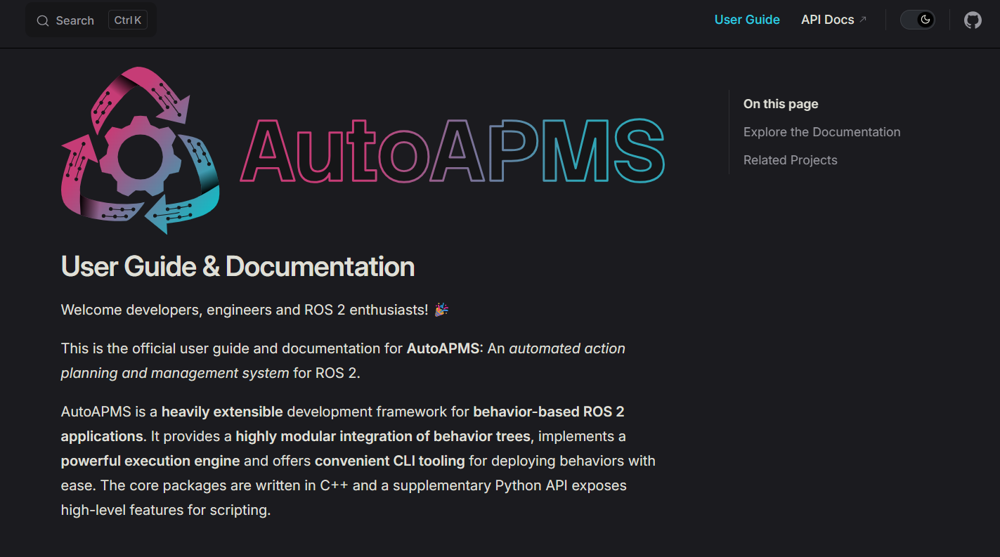
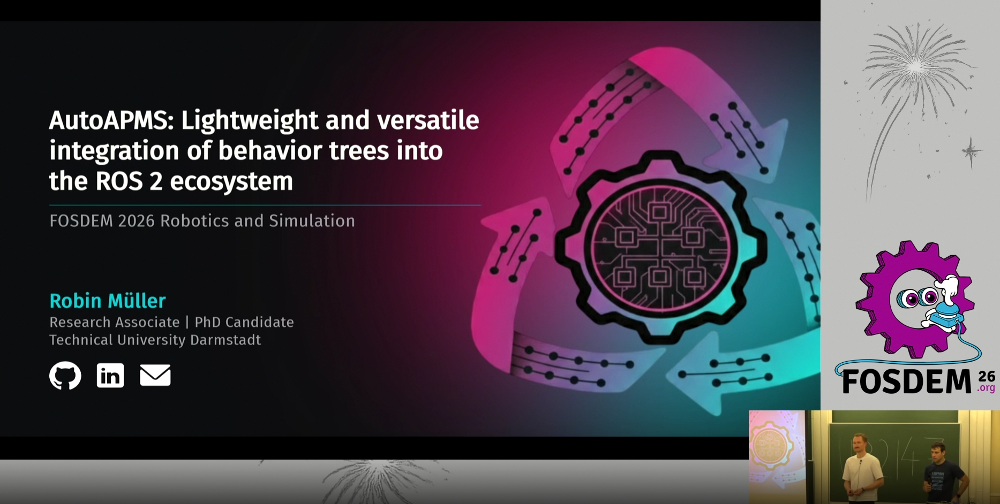

 
   &nbsp;  

# Automated Action Planning and Management System for Robotics

| Title | Link |
| --- | --- |
| **User Guide & Documentation** |  |
| **Introduction to AutoAPMS (FOSDEM 2026 Devtalk)** |  |

## Repositories

### Core Framework & Web App

| Repository | Description |  |
| --- | --- | :---: |
| [auto-apms](https://github.com/AutoAPMS/auto-apms) | Development Framework for autonomous behaviors in ROS 2 |  |
| [auto_apms_studio](https://github.com/AutoAPMS/auto_apms_studio) | Modern Web UI and ROS 2 backend for orchestrating automated systems |  |

### Integrations

| Repository | Description |  |
| --- | --- | :---: |
| [auto_apms_nav2](https://github.com/AutoAPMS/auto_apms_nav2) | Integration of [Nav2 Behavior Trees](https://docs.nav2.org/behavior_trees/index.html) |  |
| [auto-apms-px4](https://github.com/AutoAPMS/auto-apms-px4) | Abstractions for [PX4 Autopilot](https://github.com/PX4/PX4-Autopilot) |  |
| [auto_apms_simulation](https://github.com/AutoAPMS/auto_apms_simulation) | Abstractions for [pyrobosim](https://github.com/sea-bass/pyrobosim) |  |
